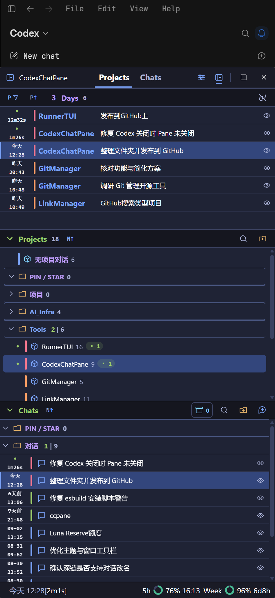

# CodexChatPane

[English](README.md) | [简体中文](README.zh-CN.md)

CodexChatPane is a Windows companion sidebar for Codex Desktop. It brings local projects, chats, activity, and usage limits into one searchable, organized window.

This is an experimental personal project, not an official Codex Desktop component. It does not upload or host your conversations.

## Features

- Browse local Codex data by project, chat, recent activity, and archive status.
- Organize projects and chats with local folders and groups, including nested folders, search, sorting, selection, and drag and drop.
- See unread, running, and error states, execution time, last activity, and usage limits.
- Preview rollout content in pages on demand by hovering over a chat's preview control.
- Open or create conversations through Codex deep links.
- With your explicit consent, use Codex Desktop's internal App MCP to rename, pin, and archive chats or pin projects.
- Configure themes, language, font sizes, window mode, log level, and tool settings import/export.

## Screenshot



## Compatibility and status

- Windows only.
- Requires a working Codex Desktop installation. Its local data formats and internal MCP may change between versions.
- This repository contains the source. GitHub Actions builds an unsigned, portable Windows executable.
- The browser preview checks the static frontend; projects, chats, window integration, and Codex actions require the desktop runtime.

## Quick start from source

Requirements: Windows, Node.js/npm, Rust stable, and Codex Desktop.

```powershell
npm ci
npm run tauri dev
```

To preview only the frontend:

```powershell
npm run dev
```

The development server listens on `127.0.0.1:1420`. On first launch, the app reads local Codex data. Tool settings and folder state are stored in the Windows user configuration directory, normally `%APPDATA%\com.codexchatpane.app\`, outside this repository.

## Get the Windows executable

After a push to `main` or a manual run of the `Windows portable build` GitHub Actions workflow, download the `CodexChatPane-windows-portable` artifact and run `CodexChatPane.exe`. The executable is unsigned, so Windows may show a SmartScreen prompt. The target machine needs WebView2 Runtime installed.

To build from source on Windows, run this from the repository root:

```powershell
powershell -NoProfile -ExecutionPolicy Bypass -File .\scripts\build-app.ps1
```

The script runs the same install, checks, and build steps as CI. The final executable is `release\CodexChatPane.exe`. See [Development and validation](doc/development.md) for environment requirements and details.

## Documentation

| Topic | Document |
| --- | --- |
| Usage | [doc/usage.md](doc/usage.md) |
| Product behavior and data ownership | [doc/product.md](doc/product.md) |
| Code structure and data flow | [doc/architecture.md](doc/architecture.md) |
| Codex data, deep links, and App MCP | [doc/integration.md](doc/integration.md) |
| Development, tests, and builds | [doc/development.md](doc/development.md) |

## Validation

```powershell
npm run build
node tests/frontend.mjs
node tests/dynamic.mjs
cargo fmt --manifest-path src-tauri/Cargo.toml --check
cargo test --manifest-path src-tauri/Cargo.toml --locked
```

A few Rust tests that require real local Codex data are explicitly ignored by default.

## Data and safety

- Codex state, history, rollout, and log files are opened read only.
- Conversation text is read only when you request a preview; it is not stored in this app's snapshots or settings.
- Folders, groups, themes, and window settings stay local and are not synced to the cloud by this app.
- Rename, pin, and archive operations require you to enable Codex MCP. The app reloads state after each operation to verify the result.
- Codex Desktop's internal App MCP is not a stable public API. Changes to it may temporarily disable write operations without affecting read only browsing.

## License

[MIT License](LICENSE)
